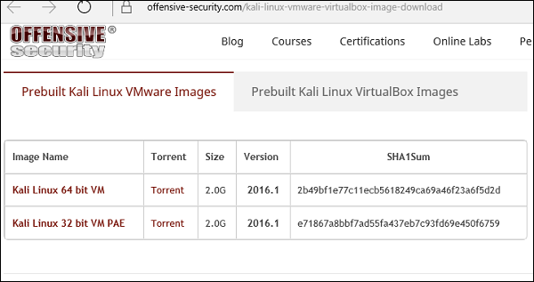
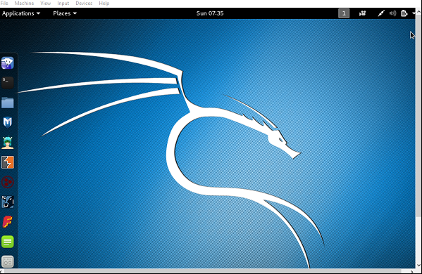

# Metasploit Framework

_“Metasploit is not hacking instant tool, it is an insane framework”_

Trata-se de uma das ferramentas mais poderosas e amplamente utilizadas para testes de penetração. Este tutorial traz um exemplo prático de um dos vários conceitos e técnicas do framework e como configurar o ambiente e usar em um cenário real.

### Objetivos gerais do tutorial:

- Apresentação do framework
- Passo-a-passo de instalação
- Exemplos de possíveis ataques utilizando a ferramenta
- O que são Exploits e Payloads no metasploit
- Utilizar o payload meterpreter para criar uma sessão em um alvo Windows

### Conceitos

O framework contém um repositório de exploits (códigos executáveis capazes de aproveitar as vulnerabilidades de sistemas em um computador local ou remoto).
A maioria de seus recursos pode ser encontrada em - www.metasploit.com. 

- Exploits

- Payloads

Está disponível em duas versões: edição comercial e gratuita. Não há grandes diferenças nas duas versões, portanto, neste tutorial, usaremos principalmente a versão Community (gratuita) do Metasploit.

### Instalação

A distribuição Kali Linux possui a versão da comunidade Metasploit embutida e centenas de outras ferramentas que facilitam os passos deste tutorial. Mas se você quiser instalar o Metasploit como uma ferramenta separada, você pode fazê-lo facilmente em sistemas executados no Linux, Windows ou Mac OS X.

Neste tutorial, vamos utilizar uma imagem pré-configurada da máquina virtual Kali Linux e incializá-la com o Virtual box.

1. Para baixar o Virtual Box, vá para www.virtualbox.org/wiki/Downloads e selecione a versão para o seu SO e configuração de hardware do seu sistema

2. Para instalar o Kali Linux, vamos baixar a imagem pré-configuradas para o Virtual Box neste [link](https://www.offensive-security.com/kali-linux-vm-vmware-virtualbox-hyperv-image-download/)

Mas também é possível baixar e instalar a distribuição Kali disponível no site oficial: www.kali.org/downloads/.

3. Agora, vamos abrir o VirtualBox e adicionar uma nova máquina. Selecione e abra a imagem do Kali Linux e inicie a máquina virtual.

Agora você pode iniciar o seu Kali. Seu nome de usuário padrão será **root** e sua senha **toor**.

4. Para verificar que já podemos usar nosso poderoso framework, abra o console do Metasploit no Kali seguindo o caminho: Aplicativos → Ferramentas de exploração → Metasploit.

Ou digite o seguinte comando no terminal:
> msfconsole

### A vítima
Neste tutorial utilizamos uma virtualização do **Windows 10 Home Edition**. Esta escolha foi feita pensando em uma situação que melhor representa uma situação do cotidiano, já que, segundo o [StatCounter]( http://gs.statcounter.com/press/android-overtakes-windows-for-first-time) o Windows é o segundo sistema operacional mais utilizado, perdendo apenas para o Android. Desta forma, sendo o Windows 10 a versão mais recente do sistema da Microsoft o escolhemos para mostrar que a ferramenta Metasploit pode ser utilizada até mesmo em um sistema comercial e supostamente seguro como o Windows 10.
Segundo a Microsoft, todas as vulnerabilidades do Windows 10 foram consertadas. De fato, os esforços da empresa dificultaram o uso de exploits remotos. Em nossas pesquisas, não foram encontradas formas de infectar uma máquina Windows 10 através de exploits remotos. Por isso, infectaremos a máquina da vítima através de um **Trojan**.

### Trojan
O Trojan se passa por um programa que simula alguma funcionalidade útil quando de fato ele esconde um programa que pode causar malefícios aos computadores e seus usuários, como abrir portas e possibilitar invasões ou roubar senhas de usuário. A principal forma de propagação destes é pela internet, onde são oferecidos como ferramentas com funções úteis – ou até mesmo vitais – para os computadores.

Os dois tipos mais comuns de Trojans são os Keyloggers (que normalmente são utilizados para roubar senhas) e os Backdoors (arquivos que possibilitam aberturas de portas para invasão). Diferente dos Vírus e Worms, eles normalmente não se auto copiam, não necessitam infectar outros programas para executar suas funções: eles são autônomos necessitando apenas ser executados.

### Ataque
Agora que já conhecemos nossa vítima e configuramos o ambiente atacante, é hora de realizarmos os ataques. Neste tutorial realizaremos as seguintes ações: 
- Tirar uma screenshot da tela da vítima.
- Tirar uma foto através da webcam da vítima.
- Capturar o stream de vídeo da webcam da vítima.

...

#### Links de referência:

http://www.khromozome.com/how-to-hack-windows-10-using-kali-linux/

https://linuxhint.com/metasploit-tutorial/

https://www.tutorialspoint.com/metasploit/metasploit_environment_setup.htm

https://www.hackingtutorials.org/metasploit-tutorials/metasploit-commands/

http://blog.corujadeti.com.br/tutorial-detalhado-em-guia-pratico-do-metasploit-copiado/

[Tirar Screenshot](https://www.offensive-security.com/metasploit-unleashed/screen-capture/)

[Hackear Webcam](https://null-byte.wonderhowto.com/how-to/hack-like-pro-secretly-hack-into-switch-on-watch-anyones-webcam-remotely-0142514/)
